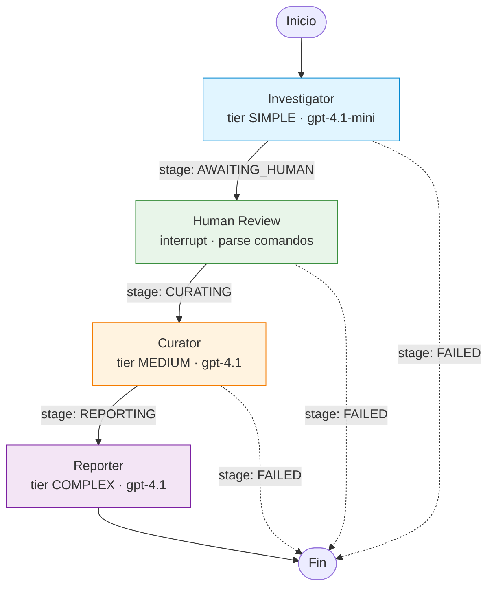

# Research Assistant — Multi-Agent con Human-in-the-Loop y Cost Optimization

Sistema de research multi-agente construido con LangGraph y Azure OpenAI. Implementa tres agentes especializados (Investigator, Curator, Reporter) orquestados en un grafo con una pausa explicita para validacion humana entre etapas, y ruteo de modelos por complejidad para optimizar costos.

---

## Tabla de contenidos

- [Caracteristicas](#caracteristicas)
- [Instalacion](#instalacion)
- [Uso](#uso)
- [Arquitectura](#arquitectura)
- [Ejemplo de corrida real](#ejemplo-de-corrida-real)
- [Optimizacion de costos](#optimizacion-de-costos)
- [Estructura del proyecto](#estructura-del-proyecto)
- [Testing](#testing)
- [Decisiones de diseno](#decisiones-de-diseno)
- [Limitaciones conocidas y roadmap](#limitaciones-conocidas-y-roadmap)

---

## Caracteristicas

- **Multi-agente real**: tres agentes LLM con prompts dedicados y tiers de complejidad asignados.
- **Human-in-the-loop genuino**: el grafo se pausa con `interrupt()` entre el Investigator y el Curator; el humano puede aprobar, rechazar, modificar o agregar subtopics con un mini-lenguaje de comandos.
- **Cost optimization medible**: ruteo de modelos por tier (SIMPLE/MEDIUM/COMPLEX), con tracking automatico de tokens y costo por llamada.
- **Validacion con Pydantic**: modelos de dominio separados de los modelos del LLM (patron Anti-Corruption Layer), con reducers de LangGraph para acumulacion correcta.
- **CLI con Rich**: tablas coloreadas, spinners durante las llamadas al LLM, Markdown renderizado, re-prompt inteligente en caso de error.
- **58 tests** (unit + integration con marker separado), ejecucion <1s.

---

## Instalacion

**Requisitos previos**: Python 3.12, [uv](https://docs.astral.sh/uv/) instalado, acceso a Azure OpenAI con deployments de `gpt-4.1-mini` y `gpt-4.1`.

```bash
# 1. Clona el repositorio
git clone https://github.com/AgustinaVidelaRivero/research-assistant.git
cd research-assistant

# 2. Instala dependencias (uv crea y usa un venv automaticamente)
uv sync

# 3. Configura las credenciales de Azure OpenAI
cp .env.example .env
# Edita .env y completa los valores (ver .env.example para detalles)
```
---

## Uso

```bash
uv run research-assistant "tu topic de research"
```

Flags opcionales:
- `--thread-id <id>`: identificador para el checkpointer de LangGraph (default: `cli-default`).
- `--no-color`: desactiva colores en el output (util para CI o piping).

### Comandos disponibles durante la revision humana

Cuando el grafo se pausa y muestra los subtopics, podes escribir comandos separados por comas:

| Comando | Ejemplo | Efecto |
|---|---|---|
| `approve <indices>` | `approve 1,3` | Aprueba los subtopics indicados |
| `approve all` | `approve all` | Aprueba todos los subtopics |
| `reject <indices>` | `reject 2` | Rechaza los subtopics indicados |
| `add '<titulo>'` | `add 'AI safety'` | Agrega un subtopic nuevo (con status APPROVED) |
| `modify <indice> to '<titulo>'` | `modify 1 to 'AI ethics'` | Cambia el titulo de un subtopic |
| `help` / `?` | `help` | Muestra los ejemplos disponibles |

Los comandos se pueden combinar: `reject 2, add 'ethical considerations'` aplica las dos operaciones en secuencia.

---

## Arquitectura

El sistema es un grafo dirigido con cuatro nodos funcionales. Los agentes LLM **nunca deciden el flujo**: el flujo lo define la estructura del grafo (Supervisor = grafo). La decision sobre que subtopics seguir investigando la toma el humano, no los modelos.



**Responsabilidades por nodo**:

- **Investigator** (gpt-4.1-mini): descompone el topic en 4-6 subtopics bien scopeados. Tarea "brainstorming" -> tier SIMPLE.
- **Human Review** (no-LLM): pausa el grafo con `interrupt()`, muestra los subtopics, parsea el comando del usuario, aplica las transformaciones y reanuda. Es el corazon del HITL.
- **Curator** (gpt-4.1): analisis profundo de los subtopics aprobados, identifica insights cross-cutting y research gaps. Tarea analitica -> tier MEDIUM.
- **Reporter** (gpt-4.1): redacta el reporte final en Markdown. La calidad del output es critica -> tier COMPLEX.

### Como funciona el estado (`GraphState`)

El workflow comparte un `GraphState` tipado con Pydantic v2. Contiene:

- `topic` (input principal),
- `stage` (`INITIAL`, `AWAITING_HUMAN`, `CURATING`, `REPORTING`, `COMPLETED`, `FAILED`),
- artefactos (`subtopics`, findings/curation, `final_report`),
- telemetria (`model_calls`, `errors`).

Para campos acumulativos se usan reducers con `operator.add` (especialmente en `model_calls` y `errors`). Asi cada nodo devuelve solo su delta (por ejemplo, una llamada nueva) y LangGraph hace el merge automaticamente.

### Human-in-the-loop real con `interrupt()`

El nodo de revision humana pausa el grafo con `interrupt()` y devuelve control a la CLI:

1. `graph.invoke(initial_state, ...)` corre hasta `human_review_node`.
2. `interrupt()` serializa el checkpoint y retorna `__interrupt__`.
3. La CLI muestra subtopics y captura comandos del usuario.
4. Se reanuda con `graph.invoke(Command(resume=...), ...)` sobre el mismo `thread_id`.
5. El nodo continua desde el mismo punto, aplica cambios y sigue a Curator/Reporter.

Esto evita separar el flujo en dos pipelines manuales y garantiza continuidad de estado entre pausa y reanudacion.

### Model routing y costos

`ModelRouter` decide deployment segun `TaskComplexity`:

- SIMPLE -> Investigator (`AZURE_OPENAI_DEPLOYMENT_SIMPLE`)
- MEDIUM -> Curator (`AZURE_OPENAI_DEPLOYMENT_MEDIUM`)
- COMPLEX -> Reporter (`AZURE_OPENAI_DEPLOYMENT_COMPLEX`)

El router tambien calcula costo por llamada usando `PRICING_PER_1M_TOKENS` y registra `input_tokens`, `output_tokens` y `cost_usd` por agente.

### Parser de comandos humanos

El mini-lenguaje de la revision humana se implementa en dos capas:

- `parser.py`: parsea texto a comandos estructurados.
- `applier.py`: aplica comandos al estado de subtopics de forma inmutable.

Se usa quote-aware splitting (state machine caracter por caracter) para soportar comas dentro de comillas, por ejemplo: `add 'ethics, fairness and trust'`. Luego, regex dedicadas validan `approve`, `reject`, `modify`, `add` y `help`.

---

## Ejemplo de corrida real

Topic: **"machine learning for climate change"**

Comando del usuario durante la revision: `approve 1, 3, reject 2, add 'ethical considerations'`

```bash
uv run research-assistant "machine learning for climate change"
```

```text
╭────────────────────────────────────────────╮
│ Research Assistant                         │
│ Topic: machine learning for climate change │
╰────────────────────────────────────────────╯

→ Running Investigator (this calls Azure)...
                                      📋 Subtopics identified by the Investigator
┏━━━━━━┳━━━━━━━━━━━━━━━━━━━━━━━━━━━━━━━━━━━━━━━━━━━━━━┳━━━━━━━━━━━━━━━━━━━━━━━━━━━━━━━━━━━━━━━━━━━━━━━━━━━━━━━━━━━━━━━┓
┃    # ┃ Title                                        ┃ Description                                                   ┃
┡━━━━━━╇━━━━━━━━━━━━━━━━━━━━━━━━━━━━━━━━━━━━━━━━━━━━━━╇━━━━━━━━━━━━━━━━━━━━━━━━━━━━━━━━━━━━━━━━━━━━━━━━━━━━━━━━━━━━━━━┩
│    1 │ Climate Data Collection and Preprocessing    │ This subtopic focuses on methods for gathering and preparing  │
│      │                                              │ climate-related datasets, including satellite imagery, sensor │
│      │                                              │ data, and historical climate records. It covers data          │
│      │                                              │ cleaning, normalization, and feature extraction techniques    │
│      │                                              │ essential for effective machine learning model training.      │
│    2 │ Predictive Modeling of Climate Variables     │ This area explores the development of machine learning models │
│      │                                              │ to forecast climate variables such as temperature,            │
│      │                                              │ precipitation, and extreme weather events. It includes time   │
│      │                                              │ series analysis, regression models, and deep learning         │
│      │                                              │ approaches tailored for climate prediction.                   │
│    3 │ Impact Assessment and Vulnerability Analysis │ This subtopic examines how machine learning can assess the    │
│      │                                              │ effects of climate change on ecosystems, agriculture, and     │
│      │                                              │ human populations. It involves classification and clustering  │
│      │                                              │ techniques to identify vulnerable regions and predict         │
│      │                                              │ potential impacts.                                            │
│    4 │ Climate Change Mitigation Strategies         │ Focuses on leveraging machine learning to optimize strategies │
│      │                                              │ aimed at reducing greenhouse gas emissions and enhancing      │
│      │                                              │ renewable energy adoption. It includes energy consumption     │
│      │                                              │ forecasting, carbon footprint estimation, and optimization of │
│      │                                              │ resource allocation.                                          │
│    5 │ Policy and Decision Support Systems          │ This area studies the integration of machine learning outputs │
│      │                                              │ into decision-making frameworks to support policymakers in    │
│      │                                              │ climate action. It covers the development of interpretable    │
│      │                                              │ models, risk assessment tools, and simulation environments    │
│      │                                              │ for evaluating policy outcomes.                               │
└──────┴──────────────────────────────────────────────┴───────────────────────────────────────────────────────────────┘

Your command(s): approve 1, 3, reject 2, add 'ethical considerations'

→ Resuming graph (Curator + Reporter)...
✅ Research complete!

╭─────────────────╮
│ 📄 Final Report │
╰─────────────────╯

                Machine Learning for Climate Change: Opportunities, Challenges, and Ethical Imperatives

(... reporte completo renderizado con colores ...)

            💰 Cost Summary
┏━━━━━━━━━━━━━━━━━━━━━━━━━━┳━━━━━━━━━━━┓
┃ Metric                   ┃     Value ┃
┡━━━━━━━━━━━━━━━━━━━━━━━━━━╇━━━━━━━━━━━┩
│ Total LLM calls          │         3 │
│ Total input tokens       │     1,704 │
│ Total output tokens      │     1,941 │
│ Total cost (USD)         │ $0.016379 │
└──────────────────────────┴───────────┘

     📞 Calls by agent
┏━━━━━━━━━━━━━━━━━┳━━━━━━━┓
┃ Agent           ┃ Calls ┃
┡━━━━━━━━━━━━━━━━━╇━━━━━━━┩
│ investigator    │     1 │
│ curator         │     1 │
│ reporter        │     1 │
└─────────────────┴───────┘
```

| Fase | Subtopics aprobados | Costo |
|---|---|---|
| Investigator | Genera 5 subtopics | ~$0.0004 |
| Human Review | Usuario aprueba 1 (Data Collection) y 3 (Impact Assessment), rechaza 2 (Predictive Modeling), agrega uno nuevo (Ethical Considerations) | $0 |
| Curator | Analisis profundo de los 3 subtopics aprobados | ~$0.006 |
| Reporter | Reporte final en Markdown de 4 secciones + referencias | ~$0.010 |
| **Total** | — | **$0.016379** |

El reporte final tiene titulo *"Machine Learning for Climate Change: Opportunities, Challenges, and Ethical Imperatives"* con 4 secciones: foundations de data collection, impact assessment con ML, ethical considerations, y gaps/future directions.

Tokens consumidos: 1,704 input + 1,941 output = 3,645 totales.

---

## Optimizacion de costos

El `ModelRouter` elige el deployment segun un `TaskComplexity` enum. Los prompts de cada agente estan disenados para la complejidad que les corresponde.

| Tier | Modelo | Input ($/M tokens) | Output ($/M tokens) | Usado por |
|---|---|---|---|---|
| SIMPLE | gpt-4.1-mini | $0.40 | $1.60 | Investigator |
| MEDIUM | gpt-4.1 | $2.00 | $8.00 | Curator |
| COMPLEX | gpt-4.1 | $2.00 | $8.00 | Reporter |

**Medicion real** (con datos de la corrida de ejemplo):

- Costo actual (con tier routing): **$0.016379**
- Costo contrafactico (si todo usara COMPLEX): **~$0.018936**
- **Ahorro: ~13.5%**

El ahorro escala con el uso del Investigator. En arquitecturas con muchas llamadas SIMPLE (clasificadores, summarizers, routers), el factor 5x entre tiers se vuelve significativo. A 1000 researches/dia, 13.5% son varios dolares diarios.

Para cambiar el modelo de un tier no se toca el codigo: se cambian las variables de entorno (`AZURE_OPENAI_DEPLOYMENT_SIMPLE`, `_MEDIUM`, `_COMPLEX`).

---

## Estructura del proyecto

```text
research-assistant/
├── src/research_assistant/
│   ├── cli.py                    # Entry point de la CLI (registrado en pyproject)
│   ├── agents/                   # Los 3 nodos LLM (Investigator/Curator/Reporter)
│   │   └── base.py               # Helpers comunes (token extraction, call record)
│   ├── core/
│   │   ├── state.py              # Pydantic models + GraphState + CostSummary
│   │   ├── model_router.py       # Routing por complexity tier
│   │   └── settings.py           # Azure OpenAI config via pydantic-settings
│   ├── graph/
│   │   ├── builder.py            # build_graph(): StateGraph con conditional edges
│   │   └── nodes.py              # human_review_node con interrupt() + router de errores
│   ├── human_input/
│   │   ├── parser.py             # Parser regex + state machine para comandos
│   │   └── applier.py            # Aplicacion inmutable de comandos a subtopics
│   ├── presentation/
│   │   ├── display.py            # Funciones de display con Rich
│   │   └── prompts.py            # Re-prompt loop con manejo de errores
│   └── tools/
│       └── search.py             # mock_web_search (ver "Decisiones de diseno")
├── tests/                        # 58 tests unit + 1 integration marker
├── scripts/smoke_test.py         # Validacion de conexion a Azure
├── .github/workflows/tests.yml   # CI de GitHub Actions
├── pyproject.toml
├── .env.example
└── README.md                     # Este archivo
```

---

## Testing

```bash
# Correr todos los tests (sin los de integracion)
uv run pytest tests/ -v

# Correr SOLO los tests de integracion (requieren credenciales de Azure)
uv run pytest tests/ -v -m integration
```

**Estrategia de testing**:

- **Tests unitarios (57)**: validan componentes aislados. Sin LLM, sin red, sin credenciales. Ejecucion <1s.
- **Tests de integracion (1, marcador `integration`)**: validan el Investigator contra Azure real. Por default se excluyen para no depender de credenciales ni generar costos en CI.
- Los tests del grafo mockean los 3 agentes LLM con `monkeypatch.setattr` para validar el flujo, el HITL, las conditional edges y la acumulacion de `model_calls` via reducer.

---


